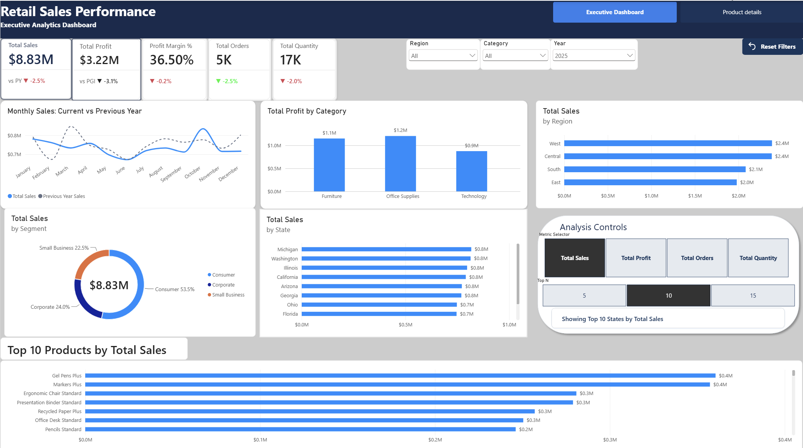

# Retail Sales Performance Dashboard | Power BI

## Project Overview 

This project is an interactive Retail Sales Performance Dashboard developed in Microsoft Power BI to analyze sales, profitability, customer segments, products, and regional performance.

The dashboard transforms retail transaction data into actionable business insights and allows users to interactively explore performance across different dimensions.

## Dashboard Preview



## Key Performance Indicators

- Total Sales: $26.76M
- Total Profit: $9.80M
- Profit Margin: 36.63%
- Total Orders: 15K
- Total Quantity Sold: 53K

## Dashboard Features

- Executive-level KPI cards
- Sales and profit analysis
- Quarterly sales trends
- Category performance analysis
- Customer segment analysis
- Regional and state-level sales analysis
- Top-performing product analysis
- Date range filtering
- Category and region slicers
- Drill-through product analysis
- Report page tooltips
- Bookmark-based Sales and Profit views

## Data Model

The Power BI data model contains three primary tables:

- **Sales** – Transaction-level sales information
- **Products** – Product, category, subcategory, cost, and pricing information
- **Customers** – Customer, segment, region, and state information

Relationships were created between the Sales fact table and the Product and Customer dimension tables using Product_ID and Customer_ID.

## DAX Measures

Key measures created for the dashboard include:

```DAX
Total Sales =
SUM(sales[Sales_Amount])
```

```DAX
Total Cost =
SUMX(
    sales,
    sales[Quantity] * RELATED(products[Unit_Cost])
)
```

```DAX
Total Profit =
[Total Sales] - [Total Cost]
```

```DAX
Profit Margin % =
DIVIDE([Total Profit], [Total Sales], 0)
```

Additional measures were created for Total Orders and Total Quantity.

## Business Questions Answered

The dashboard helps answer questions such as:

- What are the company's total sales and profit?
- What is the overall profit margin?
- Which products generate the most sales?
- Which categories are the most profitable?
- Which customer segments contribute the most revenue?
- Which states and regions perform best?
- How does sales performance change across quarters?
- How do selected categories, regions, and dates affect overall performance?

## Tools & Skills

- Microsoft Power BI
- DAX
- Data Modeling
- Data Visualization
- KPI Development
- Interactive Dashboards
- Slicers and Filters
- Drill-through
- Report Page Tooltips
- Bookmarks
- Business Intelligence
- Data Analysis

## Project Files

- `Retail_Sales_Performance_Dashboard.pbix` – Power BI project
- `Retail_Sales_Dashboard.png` – Dashboard preview

## Dashboard

The dashboard was designed to provide business stakeholders with a concise executive view of retail performance while allowing deeper analysis of products, customers, geography, and profitability.
